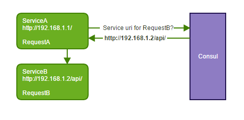
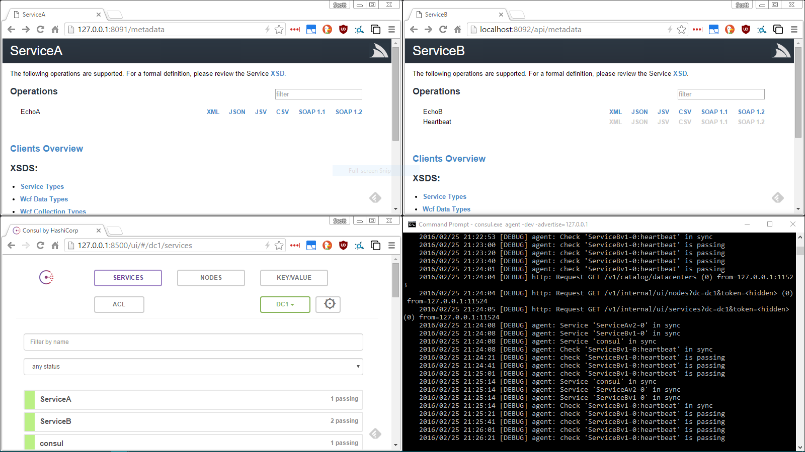

# ServiceStack.Discovery.Consul 
[](https://ci.appveyor.com/project/wwwlicious/servicestack-discovery-consul)

A plugin for [ServiceStack](https://servicestack.net/) that provides external RequestDTO endpoint discovery with [Consul.io](http://consul.io) and provides automatic service registration and health checking.



## Requirements

A consul agent must be running on the same machine as the AppHost.

## Quick Start

Install the package [https://www.nuget.org/packages/ServiceStack.Discovery.Consul](https://www.nuget.org/packages/ServiceStack.Discovery.Consul/)
```bash
Install-Package ServiceStack.Discovery.Consul
```
Add the following to your `AppHost`

```csharp
public class AppHost : AppSelfHostBase
{
    public AppHost() : base("MyService", typeof(MyService).Assembly) {}

    public override void Configure(Container container)
    {
        SetConfig(new HostConfig
        {
            // the url:port that other services will use to access this one
            WebHostUrl = "http://api.acme.com:1234"

            // optional
            ApiVersion = "2.0"
            HandlerFactoryPath = "/api/"
        });

        // Pass in any ServiceClient and it will be autowired with Func
        Plugins.Add(new ConsulFeature(new JsonServiceClient()));
    }
}
```
and use as follows
```csharp
public class MyService : Service
{
    public IServiceClient Client { get; set; }

    public void Any(RequestDTO dto)
    {
        // the client will resolve the correct uri for the external dto using consul
        var response = Client.Send(new ExternalDTO { Custom = "bob" });
    }

}
```
## Running your services

Before you start your services, you'll need to [download consul](https://www.consul.io/) and start the agent running on your machine.


The following will create an in-memory instance which is useful for testing

```bash
consul.exe agent -dev -advertise=127.0.0.1
```
You should now be able to view the [Consul UI](http://127.0.0.1:8500/ui)

Once you have added the plugin to your ServiceStack AppHost, you should see it appear
in the Consol UI when you start it.

### Automatic Service Registration


* Registers the service with a Consul agent once the AppHost has been initialised.
* Deregisters the service when the AppHost is shutdown.

#### Health checks

Each service can have a number of health checks. This allows service discovery to filter out failing instances of your services.

By default the plugin creates 2 health checks

1. Heartbeat : Creates an endpoint in your service [http://locahost:1234/reply/json/heartbeat](http://locahost:1234/reply/json/heartbeat) that expects a 200 response
2. If Redis has been configured in the AppHost, it will check Redis is responding

To turn off the default checks use the following:
```csharp
Plugins.Add(new ConsulFeature() { IncludeDefaultServiceHealth = false });
```
#### Custom health checks

You can add your own health checks

```csharp
using ConsulFeature() { ServiceChecks.Add(new ConsulRegisterCheck()) };
```
### Discovery

The default discovery mechanism uses the ServiceStack request type names to resolve all of the services capable of processing the request. This means that you should always use unique names across all your services for each of your RequestDTO's

To override the default behaviour, you can implement your own `IDiscoveryTypeResolver`

```csharp
public class CustomDiscoveryRequestTypeResolver : IDiscoveryRequestTypeResolver
{
    public string[] GetRequestTypes(IAppHost host)
    {
        // register dto's for reverse lookup below ...
    }

    public string ResolveBaseUri(object dto)
    {
        // reverse lookup service base uri from dto ...
    }
}
```

#### Autowiring Client


To autowire a client you can pass on into the `new ConsulFeature(new JsvServiceClient())` constructor. 
This will set the client property `ServiceClientBase.TypedUrlResolver = Consul.ResolveTypedUrl;` and register
the client with the Func IoC container.

You can then use an `IServiceClient` in your service and everything will just work 

```csharp
public class EchoService : Service
{
    public IServiceClient Client { get; set; }

    public void Any(int num)
    {
        // this will resolve the correct remote uri using consul for the external DTO
        var remoteResponse = Client.Post(new RemoteDTO());
    }
}
```
#### Manual Client

If you dont want the service client to be autowired, don't pass a client to the ConsulFeature constructor and set the following client property

```csharp
var client = new JsonServiceClient { TypedUrlResolver = Consul.ResolveTypedUrl };
```

### Example

The following shows the services registered with consul and passing health checks and the services running on different IP:Port/Paths




